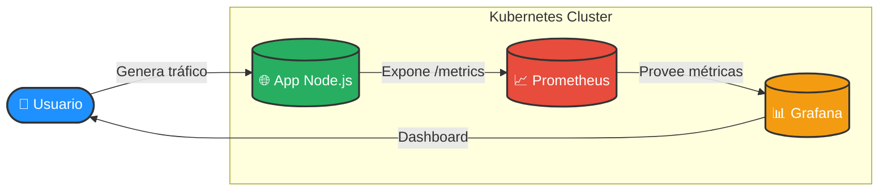
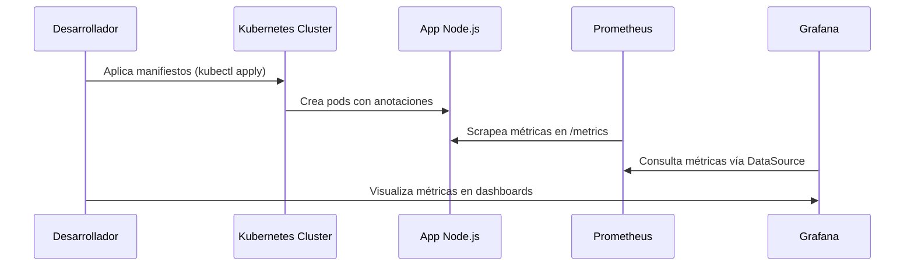

# 📊 Observabilidad con Prometheus + Grafana + Node.js en Kubernetes (Minikube)

Este proyecto práctico muestra cómo desplegar una aplicación Node.js instrumentada con Prometheus, recolectar sus métricas con Prometheus y visualizarlas en Grafana.  
El flujo completo se ejecuta en un clúster local con **Minikube**.

---

## 🎯 Objetivo

- Ejecutar una aplicación Node.js con métricas expuestas en `/metrics`
- Configurar Prometheus para recolectar automáticamente dichas métricas desde Kubernetes
- Visualizar métricas en un Dashboard de Grafana

---


## 🛠️ Tecnologías Utilizadas

[](https://minikube.sigs.k8s.io/docs/)
[](https://www.docker.com/)
[](https://nodejs.org/)
[](https://prometheus.io/)
[](https://grafana.com/)


- **Kubernetes Minikube** → ejecuta el clúster local.  
- **Docker** → empaqueta la aplicación en una imagen.  
- **Node.js + Express** → aplicación demo expuesta en `/` y `/metrics`.  
- **prom-client** → middleware que expone métricas en formato Prometheus.  
- **Prometheus** → recolecta y almacena métricas de los pods.  
- **Grafana** → visualiza métricas en dashboards interactivos. 

---

## 🏗️ Arquitectura



---

## 📋 Prerrequisitos

- [Minikube](https://minikube.sigs.k8s.io/docs/)
- [kubectl](https://kubernetes.io/docs/tasks/tools/)
- [Docker](https://docs.docker.com/get-docker/)

---

## 📥 Clonar el Repositorio

```bash
git clone https://github.com/gperzal/demo-metricas-prometheus.git
cd demo-metricas-prometheus
```

📌 **Explicación**:  
Esto descarga el código fuente y manifiestos YAML para desplegar la demo en tu máquina local.

---

## 🚀 Pasos a Seguir

### 1. Iniciar Minikube
```bash
minikube start
```
📌 **Explicación**: Inicia un clúster local de Kubernetes usando Minikube.

---

### 2. Crear namespace para monitoreo
```bash
kubectl create namespace monitoring
```
📌 **Explicación**: Separamos los componentes de observabilidad en el namespace `monitoring`.

---

### 3. Construir y cargar la imagen de la app en Minikube
```bash
docker build -t mi-app:v1 .
minikube image load mi-app:v1
```
📌 **Explicación**:  
- Construimos la imagen Docker con la aplicación Node.js.  
- `minikube image load` asegura que la imagen esté disponible dentro del clúster.

---

### 4. Desplegar la aplicación Node.js
```bash
kubectl apply -f app-deployment.yaml
kubectl get pods
```
📌 **Explicación**:  
- El primer comando crea el Deployment y el Service de la app.  
- El segundo verifica que los pods estén en estado **Running**.

---

### 5. Verificar el Service de la app
```bash
kubectl get svc
```
📌 **Explicación**: Confirma que el Service `mi-app-service` está escuchando en el puerto **8080**.

---

### 6. Probar la app localmente
```bash
kubectl port-forward svc/mi-app-service 8080:8080
```
📌 **Explicación**: Redirige el puerto 8080 del cluster a tu máquina local.  
- [http://localhost:8080](http://localhost:8080) → `¡Hola, mundo!`  
- [http://localhost:8080/metrics](http://localhost:8080/metrics) → métricas Prometheus

---

### 7. Desplegar Prometheus (con configuración incluida)
```bash
kubectl apply -f prometheus-config.yaml
kubectl apply -f prometheus-deployment.yaml -n monitoring
```
📌 **Explicación**:  
- El ConfigMap (`prometheus-config.yaml`) ya está corregido y contiene la configuración de scrapeo.  
- El Deployment (`prometheus-deployment.yaml`) levanta Prometheus en el namespace `monitoring`.

---

### 8. Acceder a Prometheus
```bash
kubectl port-forward svc/prometheus-service -n monitoring 9090:9090
```
📌 **Explicación**: Permite acceder a la interfaz de Prometheus en [http://localhost:9090](http://localhost:9090).  
Revisa en **Status → Targets** que los pods `mi-app` estén **UP**.

---

### 9. Desplegar Grafana
```bash
kubectl apply -f grafana-deployment.yaml -n monitoring
kubectl get pods -n monitoring
```
📌 **Explicación**:  
- Despliega Grafana en el namespace `monitoring`.  
- Confirma que el pod de Grafana esté en estado **Running**.

---

### 10. Acceder a Grafana
```bash
kubectl port-forward svc/grafana -n monitoring 3000:3000
```
📌 **Explicación**: Abre la interfaz de Grafana en [http://localhost:3000](http://localhost:3000).  
Credenciales por defecto: `admin / admin`.

---

### 11. Configurar la fuente de datos en Grafana
- Ir a *Connections → Data sources*  
- Añadir Prometheus con URL:
  ```
  http://prometheus-service.monitoring.svc.cluster.local:9090
  ```
- Guardar y verificar: **“Data source is working”** ✅

📌 **Explicación**: Conectamos Grafana a Prometheus dentro del cluster.

---

### 12. Probar métricas en Grafana
1. Crear un Dashboard → **+ Add visualization**
2. Seleccionar el Data Source (Prometheus)
3. Query básica:
   ```promql
   http_requests_total
   ```
4. Query con `rate` agrupada por ruta:
   ```promql
   sum by (path) (rate(http_requests_total[1m]))
   ```
5. Guardar panel como *“Tráfico HTTP – Mi App”*
6. Generar tráfico de prueba:
   ```bash
   kubectl run -it --rm curl --image=curlimages/curl --restart=Never --      sh -lc 'for i in $(seq 1 50); do curl -s http://mi-app-service:8080 > /dev/null; done'
   ```

📌 **Explicación**:  
- La primera query muestra el contador total de requests.  
- La segunda muestra la tasa de requests agrupados por path.  
- El tráfico generado aparece reflejado como un spike en el gráfico.

---

## 🧹 Limpieza
```bash
kubectl delete -f grafana-deployment.yaml -n monitoring
kubectl delete -f prometheus-deployment.yaml -n monitoring
kubectl delete -f prometheus-config.yaml -n monitoring
kubectl delete -f app-deployment.yaml
minikube delete

# Opcional: eliminar la imagen Docker local
docker rmi mi-app:v1
```

📌 **Explicación**: Estos comandos eliminan todos los recursos creados y el clúster de Minikube.

---

## ✅ Resultado Final

- App Node.js expuesta con métricas en `/metrics`
- Prometheus scrapeando automáticamente los pods con anotaciones
- Grafana conectado a Prometheus y mostrando dashboards en tiempo real



---

📌 Con esta guía, tendrás un entorno de observabilidad local listo para experimentar y extender.
